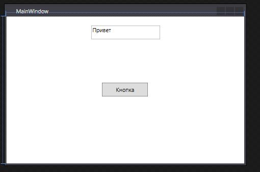
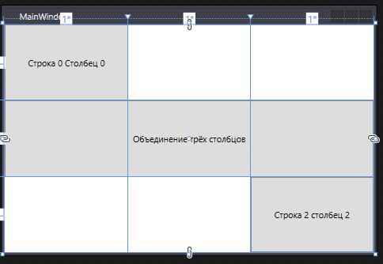
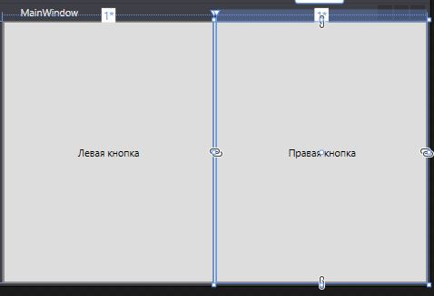
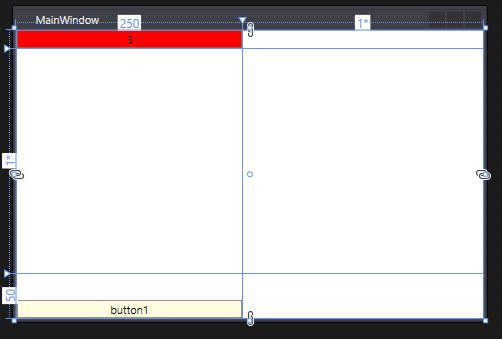

<table style="width: 100%;">
  <tr>
    <td style="text-align: center; border: none;"> 
    Минестерство образования и науки РФ <br>
    ГБПОУ РМЭ "Йошкар-Олинский Технологический колледж </td>
  </tr>
  <tr>
    <td style="text-align: center; border: none; height: 15em;"><h2>Отчет по лабораторной работe<h2><br>
    По теме: "Создание WPF-приложения. Знакомство с компоновкой"
    </td>
  </tr>
  <tr>
    <td style="text-align: right; border: none; height: 20em;">
      Разработали: Игимбаев Тимур и Шарапова Екатерина<br/>
      Группа: И-21<br/>
      Проверил: Колесников Е.И.       
    </td>
  </tr>
  <tr>
    <td style="text-align: center; border: none; height: 5em;">
    г.Йошкар-Ола, 2021</td>
  </tr>
</table>

<div style="page-break-after: always;"></div>

# Цели и задачи:

1. Ознакомиться с информацией из [лекции](https://github.com/kolei/OAP/blob/master/articles/t8_win_app.md)
2. Создать приложение WPF .NET Framework
3. Исследовать контейнеры

Grid: создать сетку с разными типами выравнивания (auto, фискированное, динамическое)
StackPanel: создать панели с разной ориентацией и выравниванием вложенных эелементов
WrapPanel

# Вывод 


```XML
<Window x:Class="wpf_timba.MainWindow"
        xmlns="http://schemas.microsoft.com/winfx/2006/xaml/presentation"
        xmlns:x="http://schemas.microsoft.com/winfx/2006/xaml"
        xmlns:d="http://schemas.microsoft.com/expression/blend/2008"
        xmlns:mc="http://schemas.openxmlformats.org/markup-compatibility/2006"
        xmlns:local="clr-namespace:wpf_timba"
        mc:Ignorable="d"
        Title="MainWindow" Height="350" Width="525">
    <Grid x:Name="grid1">
        <TextBox
            x:Name="textBox1"
            Width="150"
            Height="30"
            VerticalAlignment="Top"
            Margin="20" Text="Привет&#xD;&#xA;" />
        <Button
            x:Name="button1"
            Width="100"
            Height="30"
            Content="Кнопка"
            Click="Button_Click" />
    </Grid>
</Window>
```

```XML
<Window x:Class="wpf_timba.MainWindow"
        xmlns="http://schemas.microsoft.com/winfx/2006/xaml/presentation"
        xmlns:x="http://schemas.microsoft.com/winfx/2006/xaml"
        xmlns:d="http://schemas.microsoft.com/expression/blend/2008"
        xmlns:mc="http://schemas.openxmlformats.org/markup-compatibility/2006"
        xmlns:local="clr-namespace:wpf_timba"

        mc:Ignorable="d"
        Title="MainWindow" Height="350" Width="525">
    <Grid>
        <Grid.RowDefinitions>
            <RowDefinition></RowDefinition>
                <RowDefinition></RowDefinition>
            <RowDefinition></RowDefinition>
            
            </Grid.RowDefinitions>
           <Grid.ColumnDefinitions>
            <ColumnDefinition></ColumnDefinition>
            <ColumnDefinition></ColumnDefinition>
            <ColumnDefinition></ColumnDefinition>
            
             </Grid.ColumnDefinitions>
        <Button
            Grid.Column="0"
            Grid.Row="0"
            Content="Строка 0 Столбец 0" />
        <Button
           Grid.Column="0"
           Grid.Row="1"
           Content="Объединение трёх столбцов"
           Grid.ColumnSpan ="3" />
        <Button
            Grid.Column="2"
            Grid.Row="2"
            Content="Строка 2 столбец 2" />
            
            </Grid>
</Window>
```




```XML
<Window x:Class="wpf_timba.MainWindow"
        xmlns="http://schemas.microsoft.com/winfx/2006/xaml/presentation"
        xmlns:x="http://schemas.microsoft.com/winfx/2006/xaml"
        xmlns:d="http://schemas.microsoft.com/expression/blend/2008"
        xmlns:mc="http://schemas.openxmlformats.org/markup-compatibility/2006"
        xmlns:local="clr-namespace:wpf_timba"

        mc:Ignorable="d"
        Title="MainWindow" Height="350" Width="525">
    <Grid>
        <Grid.ColumnDefinitions>
            <ColumnDefinition Width="*"/>
            <ColumnDefinition Width="auto" />
            <ColumnDefinition Width="*" />
        </Grid.ColumnDefinitions>
        <Button
            Grid.Column="0"
            Content="Левая кнопка"></Button>
        <GridSplitter
            Grid.Column="1"
            ShowsPreview="False"
            Width="3"
            HorizontalAlignment="Center"
            VerticalAlignment="Stretch" />
        <Button
            Grid.Column="2"
            Content="Правая кнопка" />
    </Grid>
</Window>
```


```XML
<Window x:Class="wpf_timba.MainWindow"
        xmlns="http://schemas.microsoft.com/winfx/2006/xaml/presentation"
        xmlns:x="http://schemas.microsoft.com/winfx/2006/xaml"
        xmlns:d="http://schemas.microsoft.com/expression/blend/2008"
        xmlns:mc="http://schemas.openxmlformats.org/markup-compatibility/2006"
        xmlns:local="clr-namespace:wpf_timba"

        mc:Ignorable="d"
        Title="MainWindow" Height="350" Width="525">
    <Grid>
        <Grid.RowDefinitions>
            <RowDefinition Height="Auto"></RowDefinition>
            <RowDefinition></RowDefinition>
            <RowDefinition Height="50"></RowDefinition>
        </Grid.RowDefinitions>
        <Grid.ColumnDefinitions>
            <ColumnDefinition Width="250"></ColumnDefinition>
            <ColumnDefinition></ColumnDefinition>
        </Grid.ColumnDefinitions>
        <StackPanel VerticalAlignment="Bottom" Grid.RowSpan ="3">
            <Button Background="LightYellow" Content="button1"/>
        </StackPanel>
        <WrapPanel Grid.Column="1" ItemWidth="600"></WrapPanel>
        <Button Background="Blue" Content="1" />
        <Button Background="White" Content="2" />
        <Button Background="Red" Content="3" />

    </Grid>
</Window>

```
