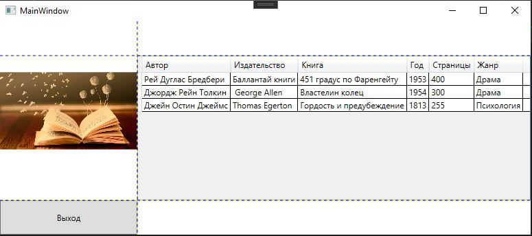

<table style="width: 100%;">
  <tr>
    <td style="text-align: center; border: none;"> 
    Минестерство образования и науки РФ <br>
    ГБПОУ РМЭ "Йошкар-Олинский Технологический колледж </td>
  </tr>
  <tr>
    <td style="text-align: center; border: none; height: 15em;"><h2>Отчет по лабораторной работe<h2><br>
    По теме: "Каркас приложения. Модель данных. Привязка данных."
    </td>
  </tr>
  <tr>
    <td style="text-align: right; border: none; height: 20em;">
      Разработал: Игимбаев Тимур<br/>
      Группа: И-21<br/>
      Проверил: Колесников Е.И.       
    </td>
  </tr>
  <tr>
    <td style="text-align: center; border: none; height: 5em;">
    г.Йошкар-Ола, 2021</td>
  </tr>
</table>

<div style="page-break-after: always;"></div>

# Цели и задачи:

1. Ознакомиться с информацией из [лекции](https://github.com/kolei/OAP/blob/master/articles/wpf_template.md)
2. Разработать WPF-приложение.

# Вывод 
1. Я разработал класс Book:
```
public class Book
    {
        public string NameAvtor { get; set; }
        public string Izdatelstvo { get; set; }
        public string NameBook { get; set; }
        public int Year { get; set; }
        public int Stranitsi { get; set; }
        public string Janr { get; set; }
    }
```
2. Создал интерфейс IDataProvider:
```
interface IDataProvider
    {
        IEnumerable<Book> GetBooks();
    }
```
3. Далее создал класс Global:
```
class Globals
    {
        public static IDataProvider dataProvider;
    }
```
4. Присвоил глобальной переменной dataProvider экземпляр класса LocalDataProvider и сохранил список книгей в свойстве BookList:
```
  public IEnumerable<Book> BookList { get; set; }

        public MainWindow()
        {
            InitializeComponent();
            DataContext = this;
            Globals.dataProvider = new LocalDataProvider();
            BookList = Globals.dataProvider.GetBooks();

        }
        private void ExitButton_Click(object sender, RoutedEventArgs e)
        {
            Application.Current.Shutdown();
        }
```
5. И привязал данные:
```XML
<DataGrid
    Grid.Row="1"
    Grid.Column="1"
    CanUserAddRows="False"
    AutoGenerateColumns="False"
    ItemsSource="{Binding BookList}">
            <DataGrid.Columns>
                <DataGridTextColumn
            Header="Автор"
            Binding="{Binding NameAvtor}"/>
                <DataGridTextColumn
            Header="Издательство"
            Binding="{Binding Izdatelstvo}"/>
                <DataGridTextColumn
            Header="Книга"
            Binding="{Binding NameBook}"/>
                <DataGridTextColumn
            Header="Год"
            Binding="{Binding Year}"/>
                <DataGridTextColumn
                    Header="Страницы"
                    Binding="{Binding Stranitsi}"/>
                <DataGridTextColumn
                    Header="Жанр"
                    Binding="{Binding Janr}"/>
            </DataGrid.Columns>
        </DataGrid>
    </Grid>
</Window>
```
# Результат работы:
