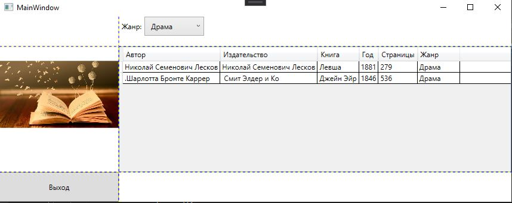

<table style="width: 100%;">
  <tr>
    <td style="text-align: center; border: none;"> 
    Минестерство образования и науки РФ <br>
    ГБПОУ РМЭ "Йошкар-Олинский Технологический колледж </td>
  </tr>
  <tr>
    <td style="text-align: center; border: none; height: 15em;"><h2>Отчет по лабораторной работe<h2><br>
    По теме: "Каркас приложения. Модель данных. Привязка данных."
    </td>
  </tr>
  <tr>
    <td style="text-align: right; border: none; height: 20em;">
      Разработал: Игимбаев Тимур<br/>
      Группа: И-21<br/>
      Проверил: Колесников Е.И.       
    </td>
  </tr>
  <tr>
    <td style="text-align: center; border: none; height: 5em;">
    г.Йошкар-Ола, 2021</td>
  </tr>
</table>

<div style="page-break-after: always;"></div>

# Цели и задачи:

1. Ознакомиться с информацией из [лекции](https://github.com/kolei/OAP/blob/master/articles/wpf_filtering.md)
2. Создать фильтрацию.

# Вывод 
1. Реализовал геттер и сеттер для списка книг:
```
public string SelectedJanr = "";

private IEnumerable<Book> _BookList = null;

public event PropertyChangedEventHandler PropertyChanged;

public IEnumerable<Book> BookList 
{
get
{
return _BookList
.Where(c => (SelectedJanr == "Все жанры" || c.Janr == SelectedJanr));
}
set
{
_BookList = value;
}
}
```
2. Создал класс для элемента справочника:
```
{
public class BookJanr
{
public string Title { get; set; }
}
}
```
3. Добавил в разметку выпадающий список для выбора жанра:
```XML
<WrapPanel
Orientation="Horizontal"
Grid.Column="1"
MinHeight="50">
<Label 
Content="Жанр:"
VerticalAlignment="Center"/>

<ComboBox
Name="BreedFilterComboBox"
SelectionChanged="BreedFilterComboBox_SelectionChanged"
VerticalAlignment="Center"
MinWidth="100"
SelectedIndex="0"
ItemsSource="{Binding BookJanrList}">

<ComboBox.ItemTemplate>
<DataTemplate>
<Label 
Content="{Binding Title}"/>
</DataTemplate>
</ComboBox.ItemTemplate>
</ComboBox>
</WrapPanel>
```
4. Добавил интерфейс окну:
```
public partial class MainWindow : Window, INotifyPropertyChanged
```
5. Реализовал интерфейс:
```
public event PropertyChangedEventHandler PropertyChanged;
```
6. Написал метод, который будет сообщать визуальной части что что-то изменилось
```
private void Invalidate()
{
if (PropertyChanged != null)
PropertyChanged(this, new PropertyChangedEventArgs("BookList"));
}
```
7. В обработчик события выбора жанра добавил вызов метода:
```
private void BreedFilterComboBox_SelectionChanged(object sender, SelectionChangedEventArgs e)
{
SelectedBreed = (BreedFilterComboBox.SelectedItem as BookJanr).Title;
Invalidate();
}
```
# Результат работы:
